<p align="center">
  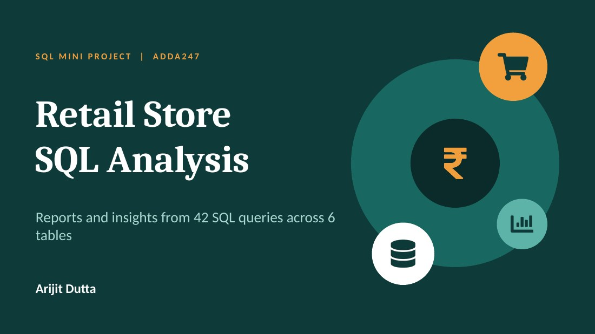
</p>

<p align="center">
  
  
  
  
</p>

<p align="center">
  <b>42 SQL queries. 6 tables. One retail store, and what its data has to say.</b><br>
  A mini project from the <i>Data Analytics with GenAI</i> course by ADDA247.
</p>

<p align="center">
  <a href="#the-business-at-a-glance">Overview</a> •
  <a href="#the-database">Database</a> •
  <a href="#from-simple-filters-to-subqueries">Approach</a> •
  <a href="#what-the-data-says">Insights</a> •
  <a href="#technique-spotlight">Technique</a> •
  <a href="#caveats-and-next-steps">Next steps</a> •
  <a href="#repository-structure">Structure</a>
</p>

---

## The business at a glance

A retail store wants to understand its customers, products, orders and payments. This project turns everyday business questions into SQL, for example:

- *Who are our active customers?*
- *Which products never sold?*
- *How much does each payment method bring in?*
- *Which orders beat that customer's own average?*

<p align="center">
  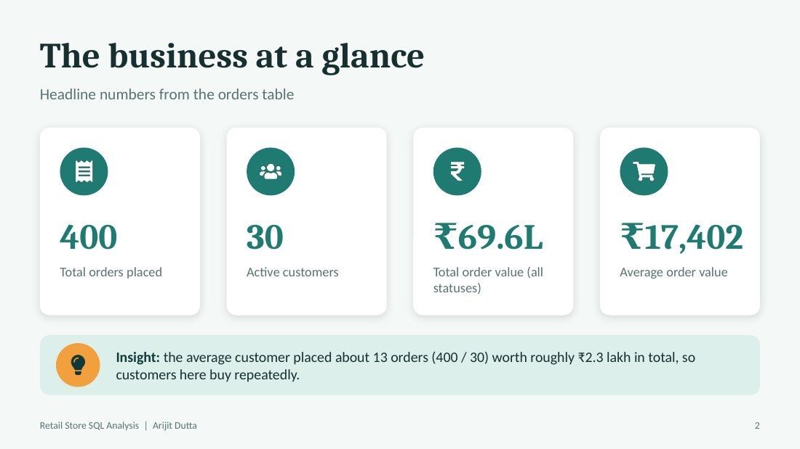
</p>

The average customer placed about 13 orders (400 / 30) worth roughly ₹2.3 lakh in total.

---

## The database

Six tables make up the store. Most questions needed two or more of them.

<p align="center">
  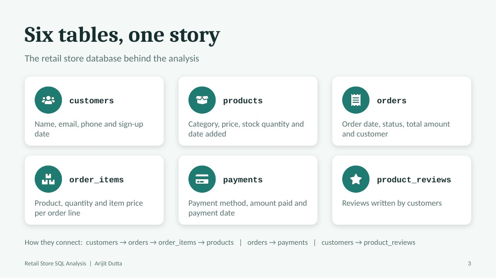
</p>

| Table | What it holds |
|---|---|
| `customers` | Name, email, phone, sign-up date |
| `products` | Category, price, stock quantity, date added |
| `orders` | Order date, status, total amount, customer |
| `order_items` | Product, quantity and item price per order line |
| `payments` | Payment method, amount paid, payment date |
| `product_reviews` | Reviews written by customers |

> The dataset itself is not included in this repository.

---

## From simple filters to subqueries

The project is organised in six levels, each adding a new SQL skill.

<p align="center">
  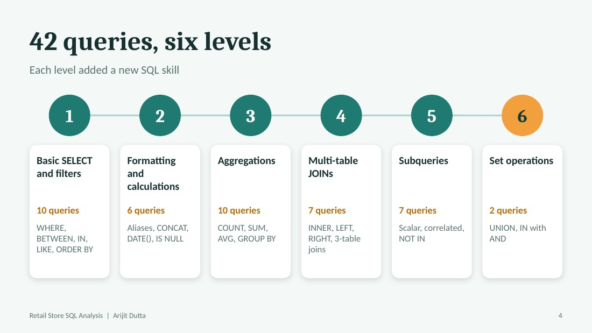
</p>

| Level | Topic | Queries | Skills used |
|:---:|---|:---:|---|
| 1 | Basic SELECT and filters | 10 | `WHERE`, `BETWEEN`, `IN`, `LIKE`, `DISTINCT`, `ORDER BY` |
| 2 | Formatting and row-level calculations | 6 | Aliases, `CONCAT`, `DATE()`, `IS NULL`, arithmetic |
| 3 | Aggregations and GROUP BY | 10 | `COUNT`, `SUM`, `AVG`, `ROUND`, `GROUP BY` |
| 4 | Multi-table JOINs | 7 | `INNER`, `LEFT`, `RIGHT` joins, 3-table joins |
| 5 | Subqueries | 7 | Scalar, correlated, `IN` / `NOT IN` |
| 6 | Set operations | 2 | `UNION`, combining `IN` conditions |

---

## What the data says

### Products: volume and price

<table>
  <tr>
    <td width="50%">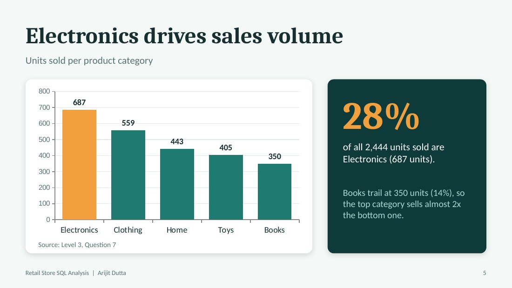</td>
    <td width="50%">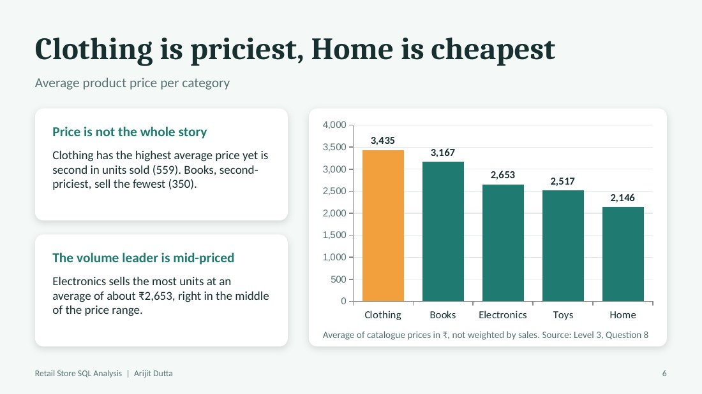</td>
  </tr>
</table>

- **Electronics** sold the most units (687 of 2,444, about 28%). **Books** sold the fewest (350), so the top category sells almost twice the bottom one.
- **Clothing** has the highest average price (₹3,434.58) and **Home** the lowest (₹2,146.37).
- Price alone doesn't explain volume: Clothing is priciest but second in units, and Books are second-priciest but sell the least.

### Payments and customers

<table>
  <tr>
    <td width="50%">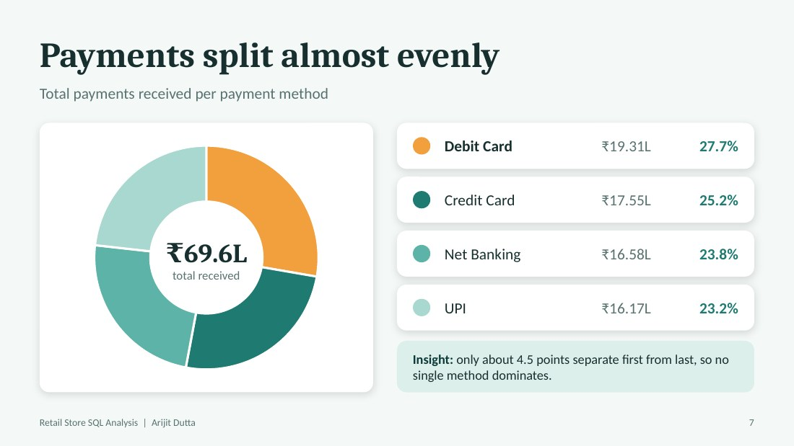</td>
    <td width="50%">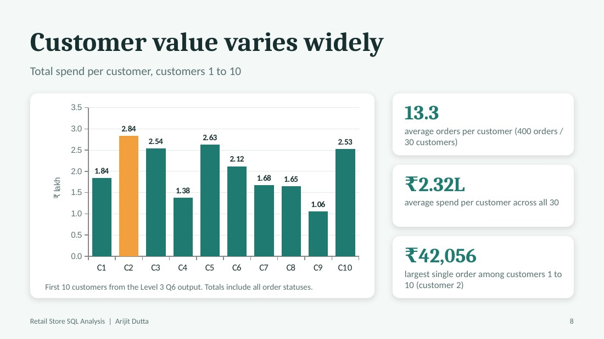</td>
  </tr>
</table>

- **Debit Card** brings in the most (₹19.31L, 27.7%), but only about 4.5 percentage points separate first from last, so no single method dominates.
- Among customers 1 to 10, total spend ranges from ₹1.06L to ₹2.84L. Customers 1 to 12 placed between 9 and 17 orders each.

### Data health check

<p align="center">
  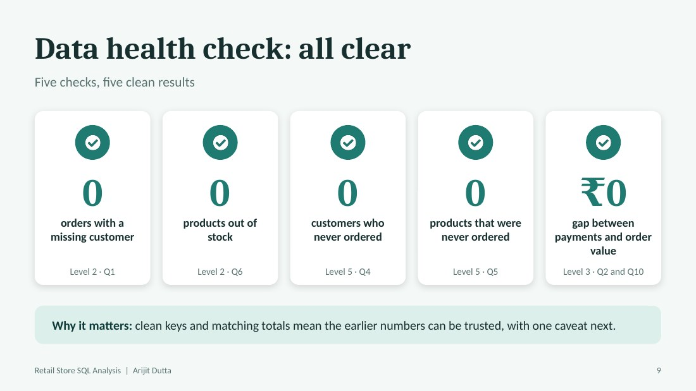
</p>

No orders with a missing customer, no out-of-stock products, every customer has ordered, every product has been ordered, and total payments equal total order value (₹69,60,973.66).

---

## Technique spotlight

<p align="center">
  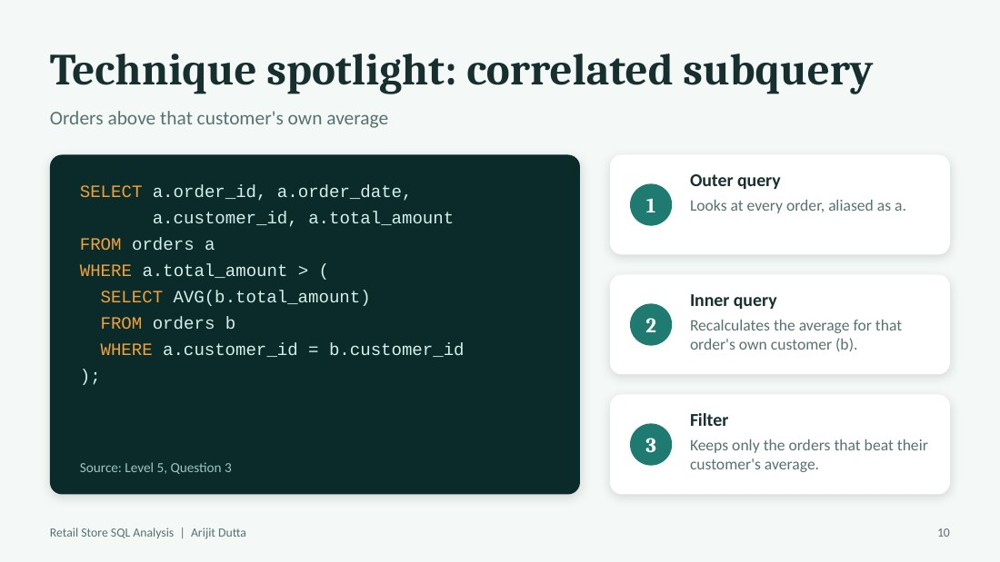
</p>

**Orders above that customer's own average** (correlated subquery, Level 5 Q3):

```sql
SELECT a.order_id, a.order_date, a.customer_id, a.total_amount
FROM orders a
WHERE a.total_amount > (
  SELECT AVG(b.total_amount) FROM orders b
  WHERE a.customer_id = b.customer_id
);
```

**Highest-value order per customer, with names** (Level 5 Q7):

```sql
SELECT c.customer_id, c.name AS customer_name, o.order_id, o.total_amount
FROM customers c
JOIN orders o ON c.customer_id = o.customer_id
WHERE o.total_amount = (
  SELECT MAX(o1.total_amount)
  FROM orders o1
  WHERE o1.customer_id = c.customer_id
);
```

---

## Caveats and next steps

<p align="center">
  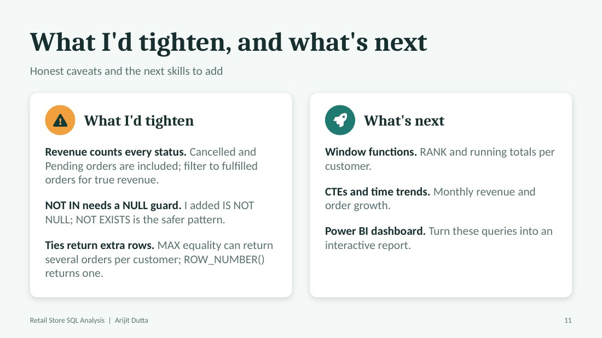
</p>

- **Revenue counts every status.** Cancelled and Pending orders are included; filtering to fulfilled orders would give true revenue.
- **`NOT IN` needs a NULL guard.** I added `IS NOT NULL`; `NOT EXISTS` is the safer pattern.
- **Ties return extra rows.** Matching on `MAX()` can return several orders per customer; `ROW_NUMBER()` returns one.
- **Next:** window functions (`RANK`, running totals), CTEs with monthly revenue trends, and a Power BI dashboard on the same data.

---

## Repository structure

```
retail-store-sql-analysis/
├── README.md
├── sql/
│   └── retail_store_analysis.sql             # all 42 queries, Levels 1-6
├── docs/
│   └── SQL_Retail_Store_Submission_Final.pdf # queries with output screenshots
├── presentation/
│   ├── Retail_Store_SQL_Analysis_Report.pptx # 12-slide insights deck
│   └── Retail_Store_SQL_Analysis_Report.pdf  # same deck as PDF
└── images/                                   # slide images used in this README
```

## Explore it yourself

1. Create a MySQL database with the six tables described above and load your own data.
2. Open `sql/retail_store_analysis.sql` in MySQL Workbench (or any MySQL client).
3. Run the queries level by level, or read `docs/SQL_Retail_Store_Submission_Final.pdf` to see each query next to its output.

## Tools

MySQL Workbench · SQL

---

<p align="center">
  <b>Arijit Dutta</b><br>
  <a href="https://www.linkedin.com/in/arijit-dutta-552b41199">LinkedIn</a> •
  <a href="https://github.com/arijitddutta">GitHub</a>
</p>
